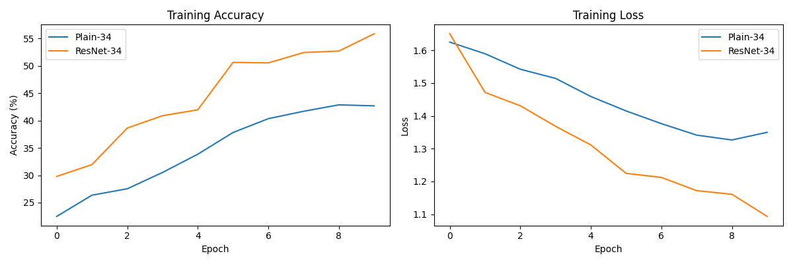

# Perbandingan Plain-34 vs ResNet-34

## Hyperparameter
- Dataset: 5 Makanan Indonesia
- Epoch: 10
- Batch Size: 32
- Optimizer: Adam
- Learning Rate: 0.001
- Augmentasi: HorizontalFlip, Rotation(15°), ColorJitter

## Hasil Akhir (Epoch Terakhir)

| Model       | Training Accuracy | Training Loss |
|-------------|-------------------|---------------|
| Plain-34    | 42.69% | 1.3499 |
| ResNet-34   | 55.87% | 1.0933 |

## Analisis Singkat
Plain-34 mengalami **degradasi performa** karena arsitektur dalam tanpa skip connection menyulitkan optimasi. Sebaliknya, ResNet-34 dengan **residual connection** memungkinkan aliran gradien langsung, sehingga konvergensi lebih cepat dan akurasi jauh lebih tinggi. Ini membuktikan efektivitas residual connection dalam mengatasi masalah degradasi pada jaringan dalam.

